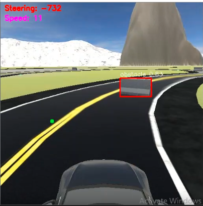
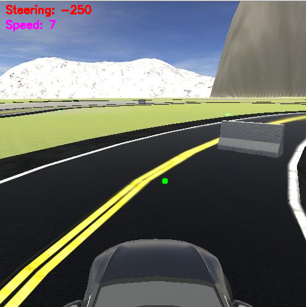
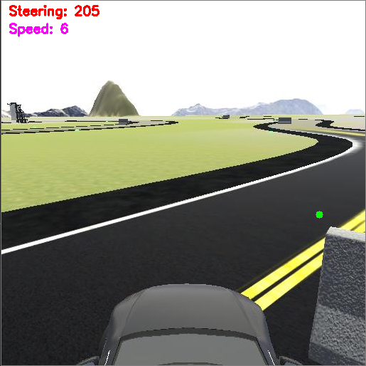

# Race Track Autonomous Driving

This project demonstrates autonomous driving behavior on a race track simulation.
The vehicle is designed to follow the centerline of the road, while also being able to detect and avoid obstacles.

## Features

- **Lane Following:**
The car continuously detects and follows the middle lane of the race track for stable navigation.

- **Obstacle Detection (with Sensors):**
-- Implemented in `obstacle_detection_with_sensor.py`
-- Obstacles are detected using simulated sensors.
-- When an obstacle is encountered, the vehicle temporarily switches to the opposite lane to overtake it, and then safely returns to its original lane.

- **Obstacle Detection (with YOLOv11 + Segmentation):**
-- Implemented in `obstacle_detection_with_yolo.py`
-- A YOLOv11 segmentation model is used to detect and localize obstacles in real time.
-- Similar to the sensor-based approach, the vehicle switches lanes to avoid the obstacle and then returns back.

## File Overview

- `obstacle_detection_with_sensor.py` → Uses sensor-based detection for obstacle avoidance.

`obstacle_detection_with_yolo.py `→ Uses YOLOv11 segmentation for obstacle detection and avoidance.

## Sample Output

The image below shows the system in action in an urban driving scenario:

 

## Future Work

- Improve lane change smoothness during obstacle avoidance.

- Optimize YOLOv11 inference for embedded deployment.

- Combine both sensor-based and vision-based methods for robustness.