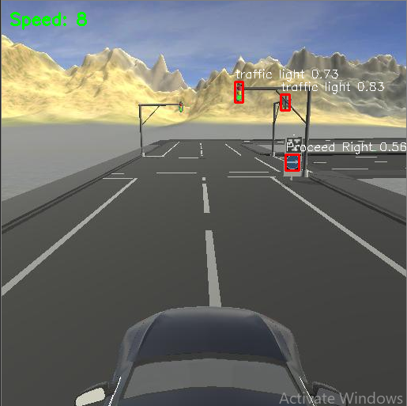

# Urban Path Detection and Autonomous Driving

This project is an **autonomous vehicle simulation** designed for urban environments. The system detects lanes and road signs, and controls vehicle behavior accordingly.

## Features
- **Lane Detection:** Detects and follows white dashed lanes.
- **Traffic Sign Detection:** Supports 5 classes:
  - Traffic Light
  - Proceed Forward *(in development)*
  - Proceed Left *(in development)*
  - Proceed Right
  - Stop *(in development)*
- **Real-time Processing:** Optimized image processing at **384 × 384 resolution** for faster inference and reduced latency.
- **Vehicle Control:** Connected to the self-driving simulation engine (`avisengine`) with speed and steering control.

## Requirements
- Python 3.7

```
pip install -r requirements.txt
```

## Usage
```bash
python urban.py
```

The system connects to the driving simulator and processes frames in real time.

## Sample Output

The image below shows the system in action in an urban driving scenario:


## Status
🚧 Project under active development — new sign classes and improved decision-making will be added.

